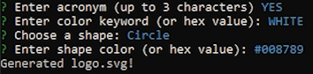

# SVG Logo Generator

## Goal: Design a node app to generate a SVG logo
This repository should show that I can properly use inquirer and jest to create a prompt-based SVG logo generator through the command line.

## Acceptance Criteria
- GIVEN a command-line application that accepts user input
- WHEN I am prompted for text
- THEN I can enter up to three characters
- WHEN I am prompted for the text color
- THEN I can enter a color keyword (OR a hexadecimal number)
- WHEN I am prompted for a shape
- THEN I am presented with a list of shapes to choose from: circle, triangle, and square
- WHEN I am prompted for the shape's color
- THEN I can enter a color keyword (OR a hexadecimal number)
- WHEN I have entered input for all the prompts
- THEN an SVG file is created named `logo.svg`
- AND the output text "Generated logo.svg" is printed in the command line
- WHEN I open the `logo.svg` file in a browser
- THEN I am shown a 300x200 pixel image that matches the criteria I entered

## Generated SVG logo

## Command line screenshot

## Usage Video
